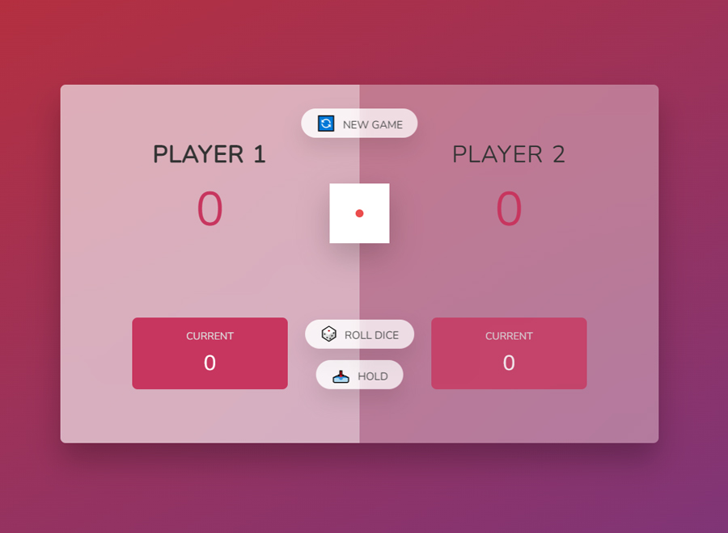

# Re-writing Pig Game by Jonas Schmedtmann

I took [Jonas Schmedtmann's](https://www.udemy.com/user/jonasschmedtmann/) Udemy Course, [The Complete JavaScript Course 2022: From Zero to Expert!](https://www.udemy.com/course/the-complete-javascript-course/) and one of the lectures was to create a game know as the PIG GAME. Way back in 2019 to 2020, the course was not updated, it has 30+ hours of lectures or something. But around the half-way of 2020 (not sure the exact year), he updated the course and now it has 60+ hours of lectures and I'm doing it again.

I challenge myself to do the PIG GAME project, but this time doing it with my own code. I completed this project around 2021, but forgot to push it here.

## Functionalities of the game:

- The default score or the WIN SCORE limit is 100, but we can set it at the game object, scoreLimit: 100 property.
- PLAYER 1 by default is the first player to ROLL the DICE.
- As a player rolls the DICE without 1 or 3 as results, the CURRENT SCORE will increase.
- The DIE ROLL numbers to avoid are set 1 and 3 but we can set it at the game object, rollNumberToAvoid: [1, 3] property. When a player rolls any of these numbers, the CURRENT SCORE will become 0 and the other player will play.
- Clicking the HOLD button will add the CURRENT SCORE to the MAIN SCORE.
- A player WINS when the MAIN SCORE is equal to or greater than the WINNING SCORE set. 

 

Lite Site URL: [Live Demo](kennyestrellaworks-pig-game.netlify.app)

 

### Used technologies
